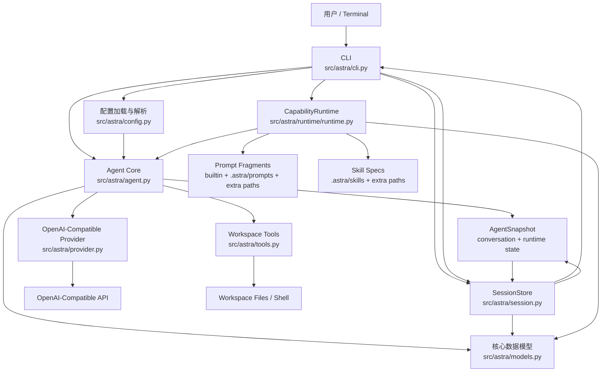

# 当前项目架构说明

本文基于 2026-03-18 仓库当前实现编写，描述 `astra` Python replica 的实际架构，而不是目标蓝图。内容重点覆盖模块边界、核心状态、主调用链、持久化与扩展点。

## 1. 总览

当前项目的主视图建议收敛为 3 层：

1. CLI 层
- 入口是 `src/astra/cli.py`
- 负责参数解析、环境与 YAML 配置加载、会话存储编排、终端输出、内建 slash 命令注册，以及交互模式下的扩展命令分流

2. Coding-Agent 层
- 入口是 `src/astra/agent.py`
- 对外仍导出为 `Agent`
- 负责 runtime 应用、system prompt 组装、skill/template 语义、runtime inspection、session 级临时状态等产品层策略

3. Core 层
- 包含 `src/astra/agent.py` 内部 `_CoreEngine` 与 `src/astra/runtime/runtime.py`
- `_CoreEngine` 负责对话消息、provider/tool 闭环、事件流、abort、snapshot/restore 等核心 agent loop 能力
- `CapabilityRuntime` 负责最小运行底座：把可重载配置解析成可执行快照，并提供工具、prompt、skill 的基础索引能力

可以把它理解为：

`CLI -> Agent(coding-agent service) -> Core(_CoreEngine + CapabilityRuntime)`

其中 CLI 负责“把协议和进程拼起来”，`Agent` 负责“把 coding-agent 语义组装起来”，Core 负责“把一轮对话跑完，并提供让 loop 运转所需的最基础底座能力”。

在这套三层主视图之下，`provider.py`、`tools.py`、`session.py`、`config.py`、`models.py` 仍然是关键支撑模块，但不再单独提升为主分层。

## 2. 模块边界

### 2.1 CLI: 进程入口与会话编排

`src/astra/cli.py` 负责：

- 解析 CLI 参数：`--model`、`--base-url`、`--cwd`、`--session`、`--new-session`、`--system-prompt`
- 加载 `<cwd>/.env`
- 读取并合并全局/项目 YAML 配置
- 构造 `CapabilityRuntime`、`Agent`、`SessionStore`
- 启动时调用一次 `agent.apply_runtime_config(...)`
- 注册 CLI built-in 命令，例如 `/help`、`/reload`、`/model`、`/base-url`、`/runtime`、`/sessions`
- 管理“session 是否已经 materialized”这件事
- 负责终端流式渲染和 SIGINT 中断行为

CLI 不负责的内容：

- 不直接组装 provider messages
- 不直接跑 tool loop
- 不直接组装 skill/template 的改写文本；主要通过 typed API 驱动 `Agent`，虽然 `Agent` 仍保留了一层兼容性的扩展命令字符串解析入口

### 2.2 Agent: coding-agent 服务层

`src/astra/agent.py` 当前同时包含一个对外服务对象 `Agent` 和一个内部 `_CoreEngine`。其中 `Agent` 负责：

- 处理 runtime reload 的应用逻辑
- 持有 `AgentRuntimeState`
- 组装最终 `current_system_prompt`
- 维护 pending one-shot skill、skill catalog snapshot
- 暴露 typed API，例如 `prompt()`、`run_skill()`、`arm_skill()`、`run_template()`
- 暴露 snapshot / restore 能力，供 session 恢复和 `/reload code` 使用
- 承担产品层策略，而不是最底层 provider/tool loop 细节

这里的设计重点是把“coding-agent 语义”和“通用执行闭环”分开：

- session/runtime 语义在 `Agent`
- 通用执行闭环在 `_CoreEngine`
- 可重建能力快照在 `CapabilityRuntime.snapshot()`

### 2.3 Core: 核心 loop 与最小运行底座

Core 由两部分组成：

- `src/astra/agent.py` 内部 `_CoreEngine`
- `src/astra/runtime/runtime.py`

其中 `CapabilityRuntime` 负责：

- 注册内建工具并按配置筛选启用工具
- 注册内置 prompt 片段和配置 prompt 片段
- 扫描 prompt 目录，把 `*.md` 注册成 `prompt:<stem>`
- 扫描 skill 目录，解析 `skill.yaml`，构建 `SkillSpec`
- 生成 runtime diagnostics，例如加载成功的 prompts/skills 和 warning
- 根据 `prompts.order` 组装基础 prompt inspection

而 Core 的边界是：

- session 持久化
- 消息历史
- CLI slash command 协议
- 产品层的 skill/template 触发语义
- 直接执行 skill 文件内容

也就是说，Core 只负责核心 agent loop 及其最基础的基建，不承载更高层的交互协议和产品策略。

### 2.4 支撑模块：Provider / Tools / SessionStore / Config / Models

`provider.py`:
- 提供 OpenAI-compatible `POST /chat/completions` SSE 流式调用
- 把 SSE chunk 转成统一的 `ProviderEvent`
- 支持中止当前 stream

`tools.py`:
- 定义 `read/write/edit/ls/find/grep/bash`
- 用 `ToolSpec` 暴露 JSON schema + handler
- 统一执行入口是 `execute_tool()`
- 所有文件路径都通过 workspace 边界检查

`session.py`:
- 会话以 JSON 文件存储在 `~/.astra-python/sessions`
- 既保存消息，也保存 `agent_snapshot`
- 支持 `create/load/save/list/fork`
- 负责 `Session <-> AgentSnapshot <-> dict` 的序列化转换

`config.py`:
- 定义配置模型、默认值、merge 与校验逻辑

`models.py`:
- 定义消息、事件、session、snapshot 等核心 dataclass

## 3. 核心数据结构

核心模型都定义在 `src/astra/models.py`。

### 3.1 对话与执行对象

- `Message`: user / assistant / tool_result 三类消息
- `ToolCall`: assistant 发出的函数调用请求
- `ProviderEvent`: provider 流式事件，类型包括 `text_delta`、`tool_call_delta`、`usage`、`done`
- `ToolSpec`: 一个工具的名称、说明、schema、handler
- `ToolContext`: 工具执行时的 cwd、workspace_root、超时与输出限制

### 3.2 Agent 状态对象

- `AgentConversationState`: 仅保存消息列表
- `AgentRuntimeState`: 保存 cwd、resolved runtime config、skill catalog snapshot、pending skill trigger
- `AgentSnapshot`: conversation + runtime 的完整快照

这说明项目当前采用的是“双状态面”设计：

- 对话面：消息历史
- 运行时面：本轮会影响行为、但不属于消息正文的状态

### 3.3 Session 对象

`Session` 比 `AgentSnapshot` 更接近持久化格式，包含：

- `id/name/cwd/created_at/updated_at`
- `model/system_prompt`
- `messages`
- `skill_catalog_snapshot`
- `parent_session_id`
- `agent_snapshot`

这里保留了两份信息：

- 兼容和展示友好的顶层字段
- 用于精确恢复运行态的 `agent_snapshot`

这使得恢复逻辑可以兼容旧格式，又能保住 pending skill、base_url 等 runtime-only 状态。

## 4. 配置架构

配置由 `src/astra/config.py` 定义，分三步处理：

1. 读取
- 全局配置：`~/.astra-python/config.yaml`
- 项目配置：`<cwd>/.astra/config.yaml`
- `.env`：只补充进程环境中缺失的值

2. 合并
- YAML 采用深度合并，项目配置覆盖全局配置

3. 解析为最终运行态
- `model = CLI > YAML > OPENAI_MODEL > DEFAULT_MODEL`
- `base_url = CLI > YAML > OPENAI_BASE_URL > DEFAULT_BASE_URL`
- `system_prompt = CLI > YAML > ""`

当前配置模型分成几块：

- `RuntimeConfig`: 原始可选配置
- `ResolvedRuntimeConfig`: 解析后的最终配置
- `ToolRuntimeConfig`: enabled tools 与默认限制
- `PromptRuntimeConfig`: prompt 顺序
- `CapabilitiesConfig`: 额外 prompt/skill 搜索路径

当前支持的可重载配置字段主要是：

- `model`
- `base_url`
- `system_prompt`
- `tools.enabled`
- `tools.defaults.read.max_lines`
- `tools.defaults.bash.timeout_seconds`
- `tools.defaults.bash.max_output_bytes`
- `prompts.order`
- `capabilities.prompts.paths`
- `capabilities.skills.paths`

其中 `capabilities.skills.enabled` 已被明确移除，若配置中出现会直接报错。

## 5. Runtime Snapshot 架构

`CapabilityRuntime.reload(runtime_config)` 每次都会全量重建一个 `RuntimeSnapshot`，其中包括：

- `tools`: 当前启用的 `ToolSpec` 字典
- `prompt_fragments`: 当前已发现的 prompt 片段
- `skills`: 当前已发现的 `SkillSpec`
- `diagnostics`: warnings、loaded prompts、loaded skills

### 5.1 Prompt 来源

prompt 片段来自三类来源：

- `builtin:base`
- `config:system`
- 外部 prompt 文件，命名为 `prompt:<stem>`

外部 prompt 搜索路径：

- `~/.astra-python/prompts`
- `<cwd>/.astra/prompts`
- `capabilities.prompts.paths`

### 5.2 Skill 来源

skill 从以下目录发现：

- `~/.astra-python/skills/*`
- `<cwd>/.astra/skills/*`
- `capabilities.skills.paths/*`

每个 skill 目录要求至少有：

- `skill.yaml`
- YAML 中声明的资源文件

当前 skill 只做“发现 + 元数据索引”，不会在 reload 时把 skill 正文塞进 system prompt。正文仍然留在磁盘上，等模型在需要时通过 `read` 工具按文件读取。

这符合仓库要求里的一个重要设计原则：discovery 不等于 activation。

## 6. System Prompt 组装架构

真正发给 provider 的 system prompt 不在 CLI，也不完全在 `CapabilityRuntime`，而是在 `Agent.inspect_prompt()` 中完成最终装配。

装配顺序是：

1. 先按 `runtime_config.prompts.order` 取默认 prompt 片段
2. 再注入 session 级 skill catalog 文本
3. 去重并用空行拼接

这里有两个关键点：

1. `CapabilityRuntime.inspect_prompt()` 只负责 runtime 视角的基础片段装配
2. `Agent.inspect_prompt()` 会再叠加 session 维度状态

因此最终 provider prompt 依赖两类信息：

- runtime 配置与磁盘发现结果
- session 运行态，比如当前 skill catalog snapshot

### 6.1 为什么 skill catalog 要注入 system prompt

当前实现不会预加载 skill 正文，只注入一个“技能目录”，内容包括：

- skill 名称
- summary
- when_to_use
- 需要按什么顺序读哪些文件

这让模型先知道“有哪些技能可用”，然后再借助 `read` 工具按需读取。这样可以：

- 控制 system prompt 体积
- 保持 skill 文本以磁盘文件为单一事实来源
- 避免 discovery 时自动生效

## 7. 请求执行链路

一轮普通请求的实际路径如下。

### 7.1 启动阶段

`cli.main()` 会按顺序完成：

1. 解析参数
2. 加载 env 和 YAML
3. resolve runtime config
4. 检查 `OPENAI_API_KEY`
5. 初始化 `SessionStore`
6. 初始化 `CapabilityRuntime`
7. 初始化 `Agent`
8. 调用 `agent.apply_runtime_config(runtime_config)`
9. 如有 `--session`，恢复目标 session

### 7.2 REPL 分流

在交互模式下，每行输入按下面顺序处理：

1. 先试 CLI built-in 命令注册表
2. 再优先由 CLI 解析 `/skill:` 和 `/template:`，并转成对 `Agent` typed API 的调用
3. 最后才当作普通用户 prompt

这是当前主路径上的责任分离：

- CLI 管自己的 slash commands
- `Agent` 管 skill/template 语义，并且仍保留 `try_handle_extension_command()` 作为兼容性的命令字符串解析入口

### 7.3 普通请求主循环

`run_user_prompt(text)` -> `agent.prompt(text)` -> `agent._run()`

在 `agent.prompt()` 中：

1. 如有 pending one-shot skill，先消费并改写用户输入
2. 追加一条 user message
3. 调用 `_run()` 进入 provider/tool 闭环

在 `agent._run()` 中：

1. 组装 provider messages
- 可选 system prompt
- 历史 user / assistant / tool_result

2. 组装 provider tools
- 当前启用工具的 OpenAI function schema

3. 发起 streaming chat request

4. 读取 provider 事件
- 文本增量累积到 assistant content
- tool call 增量按 index 聚合成完整调用
- usage 单独记录

5. 流结束后落一条 assistant message

6. 如果没有 tool calls，本轮结束

7. 如果有 tool calls：
- 逐个执行工具
- 生成 `tool_result` message
- 再次回到 provider 请求

这就是一个标准的 ReAct/function-calling 闭环：

`user -> assistant(tool calls) -> tool_result -> assistant -> ... -> final assistant`

## 8. Slash Command 架构

### 8.1 CLI built-in commands

CLI 自己注册并处理的命令包括：

- `/help`
- `/reload`
- `/reload code`
- `/model`
- `/base-url`
- `/tools`
- `/skills`
- `/templates`
- `/runtime`
- `/sessions`
- `/resume`
- `/switch`
- `/fork`
- `/rename`
- `/save`
- `/exit`

这些命令主要操作：

- 配置与 runtime reload
- 会话存储与切换
- 终端展示

### 8.2 Extension 命令与 typed API

CLI 当前暴露两个核心扩展命令：

- `/skill:<name> [request]`
- `/template:<name> <request>`

其中：

- `/skill:<name> <request>` 会立即改写成本轮用户请求并执行
- `/skill:<name>` 会武装下一条普通输入，只生效一次
- `/template:<name> <request>` 会立即改写成本轮用户请求并执行，template 正文插入该条 user message 头部
- 当前 template 名称实际来自 runtime 中已加载的 `prompt:<stem>` 片段

但这部分现在分成两层：

- CLI 是交互模式下的首选解析入口
- `Agent` 负责真正的 typed 行为方法，例如 `run_skill()`、`arm_skill()`、`run_template()`，并保留兼容性的字符串解析入口

这样 `Agent` 可以被非 CLI 入口复用，而不用依赖 slash command 字符串协议。

## 9. Session 与持久化架构

### 9.1 Session materialization 规则

CLI 启动时会先创建一个 `Session` 对象，但默认 `materialized=False`。这表示：

- 进程内有当前 session 状态
- 但磁盘上不一定已经有 session JSON

只有发生正常用户请求，或者会触发真实请求的扩展命令时，CLI 才会在请求完成后调用 `persist_agent_state(create_if_needed=True)`，把 session 真正写到磁盘。

这意味着 slash 命令本身不会凭空制造一个空会话文件。

### 9.2 为什么要保存 agent snapshot

当前 session 持久化不是只存消息，还会存 `agent_snapshot`。原因是单靠消息历史无法恢复这些 runtime-only 状态：

- 当前生效的 `base_url`
- pending one-shot skill
- 会话中的 skill catalog snapshot
- 工具默认值、prompt order、capability paths 等 resolved runtime 信息
- 当前生效的 `model` 与 `system_prompt`

因此恢复 session 时，CLI 会：

1. 把 session 转回 `AgentSnapshot`
2. 调 `agent.restore(snapshot)`
3. 再根据快照中的 runtime config 调 `agent.apply_runtime_config(...)`

这个“两段式恢复”设计让会话既能恢复内存状态，也能重新对齐当前 runtime snapshot。

### 9.3 SessionStore 的职责

`SessionStore` 很纯粹，只负责：

- JSON 文件路径管理
- create/load/save/list/fork

它不负责：

- prompt 组装
- runtime reload
- CLI 命令逻辑
- provider 调用

## 10. 工具安全边界

`src/astra/tools.py` 体现了项目的本地安全边界设计。

### 10.1 Workspace 约束

所有路径都经过 `resolve_workspace_path()`：

- 相对路径会基于 `workspace_root` 解析
- 最终 `resolve()` 后必须仍在 workspace 内
- 路径逃逸会直接报错

### 10.2 工具集合

当前内建工具有：

- `read`
- `write`
- `edit`
- `ls`
- `find`
- `grep`
- `bash`

其中：

- `read` 只支持 UTF-8 文本，支持按行截断
- `bash` 支持 timeout 与最大输出字节数，超长输出会写到临时日志文件
- `find/grep` 会跳过 `.git`、`.venv`、`node_modules` 等目录

### 10.3 工具结果格式

所有工具结果最终统一为：

- `OK\n...`
- `ERROR\n...`

这样 provider 看见的 tool message 格式稳定，便于下一轮模型消费。

## 11. Provider 适配架构

`src/astra/provider.py` 当前是一个非常薄的 OpenAI-compatible 适配层：

- 使用标准库 `http.client` 发请求
- 请求地址固定为 `{base_url}/chat/completions`
- 开启 `stream=True`
- 读取 SSE data 行
- 转换为统一的 `ProviderEvent`

它支持三类主要输出：

- assistant 文本增量
- tool call 增量
- usage

Provider 层的优点是简单、依赖少、与 OpenAI-compatible 网关耦合面小；代价是功能也比较克制，当前只覆盖本项目需要的核心 streaming chat 能力。

## 12. 运行时热更新架构

### 12.1 `/reload`

稳定路径是 `/reload`：

1. CLI 重读 env 与 YAML
2. resolve 新的 `ResolvedRuntimeConfig`
3. 调 `agent.apply_runtime_config(...)`
4. Agent 让 `CapabilityRuntime.reload(...)` 重建能力快照
5. 刷新 provider、tools、system prompt、skill catalog 合并结果

### 12.2 `/reload code`

`/reload code` 是 best-effort developer convenience：

- 通过 `importlib.reload()` 热重载多个模块
- 先把原 agent snapshot 序列化成 dict
- 重建 runtime 和 agent
- 再恢复 snapshot
- 最后再走一次 runtime reload

这条路径明显比 `/reload` 更脆弱，但代码里已经尽量用 snapshot 保住 session 状态。

### 12.3 Streaming 期间禁止 reload

无论 `/reload` 还是 `/reload code`，在 `agent.is_streaming` 时都直接拒绝。这是为了避免：

- provider stream 还没结束时 runtime 被替换
- tools/provider/system prompt 在中途切换
- 快照与真实执行现场不一致

## 13. 当前架构的主要特点

### 13.1 优点

1. 模块边界清晰
- CLI、Agent、Runtime、Provider、Tools、SessionStore 分工明确

2. 状态建模相对完整
- 把消息历史和 runtime-only 状态分开保存

3. 热更新路径明确
- `/reload` 针对配置
- `/reload code` 针对开发便利

4. 扩展机制克制
- skill/template 被做成“发现 + 显式触发”，没有隐式自动激活

5. 安全边界直观
- 工具统一受 workspace 路径检查和输出限制约束

### 13.2 目前的限制

1. Provider 抽象还比较薄
- 现在基本只适配 OpenAI-compatible chat completions SSE

2. 工具系统仍是内建工具集
- 还没有独立的外部 tool plugin 机制

3. Capability runtime 是“索引层”，不是“执行层”
- skill 只提供目录和元数据，不直接参与执行编排

4. CLI 仍承担了较多流程编排代码
- 特别是 session materialization、restore、reload code 逻辑都在 CLI

## 14. 一句话总结

当前项目的实际架构是：

- 用 `cli.py` 做进程入口、配置解析和 session 编排
- 用 `agent.py` 做核心状态机、prompt 装配和 provider/tool 闭环
- 用 `runtime/runtime.py` 做可重载能力发现与快照
- 用 `session.py`、`provider.py`、`tools.py` 分别承担持久化、模型协议适配、本地工具执行

这是一个“内核和终端明确分层、运行态可重载、会话可恢复”的命令行 agent 架构。
