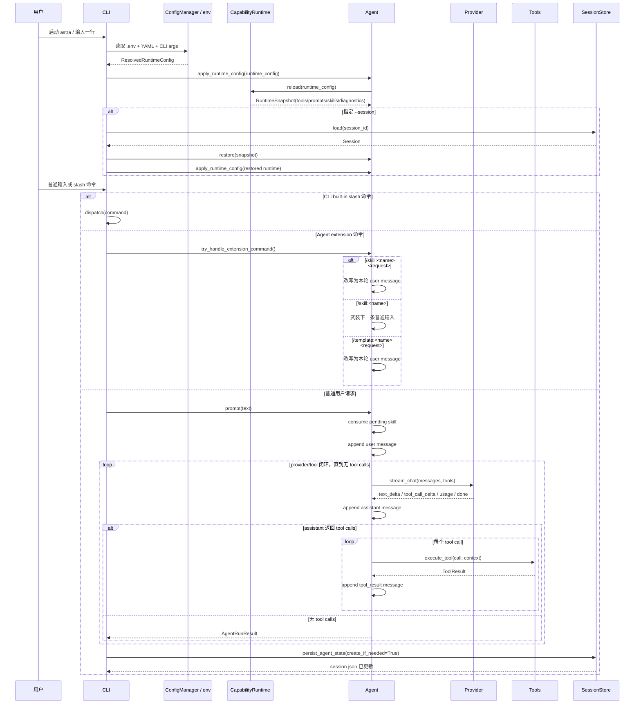

# 请求流程（V2，按当前实现）

本文基于当前代码实现（`src/astra/*.py`）描述真实请求链路。  
旧文档 `docs/request_flow.md` 保留不变，本文件作为更新版本。

## 1. 启动与配置解析

入口：`python -m astra` -> `astra.cli.main()`

1. 解析 CLI 参数：`--model`、`--base-url`、`--cwd`、`--session`、`--new-session`、`--system-prompt`、`prompt`。
2. 读取环境变量：
- 先复制当前进程环境。
- 再读取 `<cwd>/.env`，仅对缺失键做 `setdefault`（不会覆盖已有环境变量）。
3. 读取配置文件并深度合并：
- 全局：`~/.astra-python/config.yaml`
- 项目：`<cwd>/.astra/config.yaml`（覆盖全局同名字段）
4. 解析运行时配置优先级：
- `model = CLI > YAML > OPENAI_MODEL > 默认(gpt-5.2)`
- `base_url = CLI > YAML > OPENAI_BASE_URL > 默认(https://api.openai.com/v1)`
- `system_prompt = CLI > YAML > ""`
5. 检查 `OPENAI_API_KEY`，缺失直接退出。
6. 初始化 `CapabilityRuntime`、`Agent`、`SessionStore` 和一个“未落盘”的会话状态（`materialized=False`）。
7. 执行一次 `agent.apply_runtime_config(runtime_config)`，完成工具、prompt、skill 的首次加载。
8. 若传入 `--session` 且未 `--new-session`，加载并恢复该会话快照，再按会话内的 model/base_url/system_prompt 重建运行时。

## 2. Runtime Reload 实际产物

`CapabilityRuntime.reload()` 每次会重建快照：

1. 注册所有内建工具，再按 `tools.enabled` 筛选启用工具。
2. 注册两个基础 prompt 片段：
- `builtin:base`（内置默认系统提示）
- `config:system`（运行时 `system_prompt`）
3. 扫描 prompt 目录中的 `*.md` 并注册为 `prompt:<stem>`：
- `~/.astra-python/prompts`
- `<cwd>/.astra/prompts`
- `capabilities.prompts.paths`
4. 扫描 skill 根目录子目录中的 `skill.yaml`：
- `~/.astra-python/skills/*/skill.yaml`
- `capabilities.skills.paths/*/skill.yaml`
- `<cwd>/.astra/skills/*/skill.yaml`
5. 解析 skill 元数据（`name/summary/when_to_use`）和资源文件列表（`prompt_files/template_files/context_files`），仅做索引，不预加载正文。
6. 若 skill 重名，按固定优先级选出唯一生效项：project > extra paths（后配置者覆盖前配置者） > global；同时记录冲突 diagnostics。
7. 生成 diagnostics（`warnings/loaded_prompts/loaded_skills/skill_conflicts`）。
8. 若发现 skill 但 `read` 未启用，写入 warning。

注意：`capabilities.skills.enabled` 已移除，配置中出现会报错。

## 3. 输入分流（REPL 与一次性模式）

### REPL 模式

每次读入一行后分流顺序：

1. 先尝试命令注册表（`/help`、`/reload`、`/model`、`/runtime`、`/sessions` 等）。
2. 若未命中，再尝试扩展命令（`/skill:<name>`、`/template:<name> <request>`）。
3. 都未命中时，作为普通用户请求走 `run_user_prompt()`。

### 一次性模式

传入位置参数 `prompt` 时，直接 `run_user_prompt(text)`，无 REPL 循环。

## 4. 普通请求主链路

`run_user_prompt(text)` -> `agent.prompt(text)`

1. 若是新会话且尚未命名，用首条普通输入作为默认会话名。
2. `agent.prompt()` 先消费 pending skill（如果之前执行过 `/skill:<name>` 仅武装）。
3. 写入一条 user message（可带 skill metadata）。
4. 进入 `agent._run()` 执行 provider + tools 循环。
5. 返回后由 CLI 侧调用 `persist_agent_state(create_if_needed=True)` 落盘会话。

关键点：当前实现是“请求完成后落盘”，不是“发请求前先落盘”。

## 5. Provider + Tools 闭环

`agent._run()` 的循环逻辑：

1. 组装 provider messages：
- 可选首条 system（`current_system_prompt`）
- 历史 `user/assistant/tool_result`
2. 组装 tools（OpenAI function calling schema）。
3. 请求 `POST {base_url}/chat/completions`（SSE 流式）。
4. 流中累计：
- 文本增量 `text_delta`
- 工具调用增量 `tool_call_delta`（按 index 聚合 id/name/arguments）
- `usage`
5. 一轮结束后落一条 assistant message（可带 `tool_calls`）。
6. 若无 tool calls：本轮结束并返回。
7. 若有 tool calls：逐个执行本地工具，写入 `tool_result` message，再进入下一轮 provider 请求。

异常路径：

- Ctrl+C 在流式期间会触发 abort，返回 `Request aborted`。
- Provider/工具异常会进入 `error`，当前 turn 结束，不再继续后续工具循环。

## 6. Prompt 组装（实际发送到 provider 的 system）

`Agent.inspect_prompt()` 是 system prompt 的真实装配路径：

1. 先按 `prompts.order` 取默认片段（来自 runtime）。
2. 注入 session skill catalog 文本（仅目录与使用说明；不含 skill 正文，且要求 `read` 工具可用）。
3. 去重并用空行拼接，结果写到 `current_system_prompt`。

`/runtime prompt` 与 `/runtime json prompt` 使用同一路径，不会与实际 provider prompt 分叉。

## 7. Skill / Template 行为

### `/skill:<name> <request>`

立即改写为普通用户请求并发起本轮调用：

- 改写文本会显式要求“本轮使用该 skill、先按顺序 read skill 文件、不是永久模式”。
- 在用户消息 metadata 中记录原始命令与 skill 触发信息。

### `/skill:<name>`

仅武装下一条普通输入（一次性）：

- 下一条 `agent.prompt()` 消费后自动清除 pending 状态。
- 不会切换为永久 skill 模式。

### `/template:<name> <request>`

立即改写为普通用户请求并发起本轮调用：

- 改写文本会把 template 正文插入该条 user message 的头部。
- 在用户消息 metadata 中记录原始命令与 template 触发信息。

约束：

- `/skill:` 依赖 `read` 工具；read 被禁用时返回错误。
- 失效 skill 会被标记为 `history_only`，保留历史可追溯性但不可触发。

## 8. 会话持久化真实规则

1. 程序启动时会先创建会话对象，但默认不落盘（`materialized=False`）。
2. 只有在发生实际消息写入后（普通请求或会触发请求的扩展命令）才会 materialize 并保存到 `~/.astra-python/sessions/<id>.json`。
3. 大多数 slash 命令本身不会创建新会话文件（仅已有 materialized 会话时会更新保存）。
4. `/save` 仅对已 materialized 会话有效；否则提示 `No session to save.`。
5. `/fork` 仅对已保存会话有效；会复制消息与快照并生成新会话 ID。
6. 会话保存内容包括：
- 消息历史（含 tool calls/results）
- `model/system_prompt/cwd`
- skill catalog snapshot
- agent snapshot（含 pending skill、runtime config 等）

## 9. `/reload` 与 `/reload code`

1. 流式响应期间，`/reload` 与 `/reload code` 都会被拒绝。
2. `/reload`：重新读取 env/config 并 `apply_runtime_config()`，打印 reload 摘要与 warnings。
3. `/reload code`：best-effort 热重载 Python 模块，先恢复会话快照，再走一次 `/reload` 逻辑。

## 10. 工具执行与安全边界

1. 文件路径统一通过 `resolve_workspace_path()` 限制在 `workspace_root` 内，阻止路径逃逸。
2. `read` 仅支持 UTF-8 文本，可按行读取并受 `read_max_lines` 限制。
3. `bash` 在会话 cwd 执行，受超时与输出字节上限约束，超限时保留尾部并写临时完整日志。
4. `find/grep` 会跳过大目录（如 `.git`、`.venv`、`node_modules` 等）。
5. 工具结果统一封装为 `OK\n...` 或 `ERROR\n...`。
